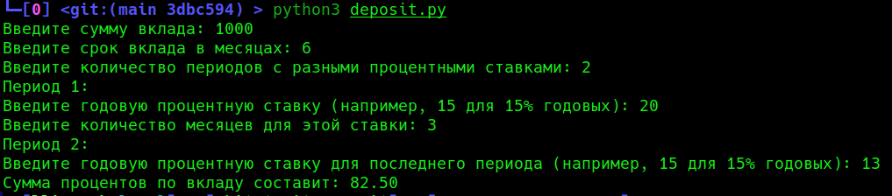

# Калькулятор процентов, полученных по вкладам

В разных банках есть предложения, чтобы вы открыли накопительный счёт и положили туда свою денежку, чтобы банк мог пользоваться вашими деньгами и зарабатывать себе на колбаску с сыром где нибудь на теплых берегах. Вас же пытаются про стимулировать процентами за пользование вашими деньгами. Как правило крупно указывается максимальный процент, который начисляют только в первые месяцы, далее процент будет уже ниже. Это конечно пишут, когда читаешь условия. Но вот сколько можно получить процентом в голове не сразу может получиться посчитать.

Для интереса написал программку, которая считает полученные проценты и стоит ли вообще парится по этому поводу.

Так как условия у всех банков разные, то придётся их перечислять.


## Запуск

Запускаем скрипт `deposit.py` и отвечаем на вопросы

```bash
  python3 deposit.py
```




---

## Планы на будущее

- [ ] Запоминать условия по банкам, чтобы не заполнять их каждый раз
